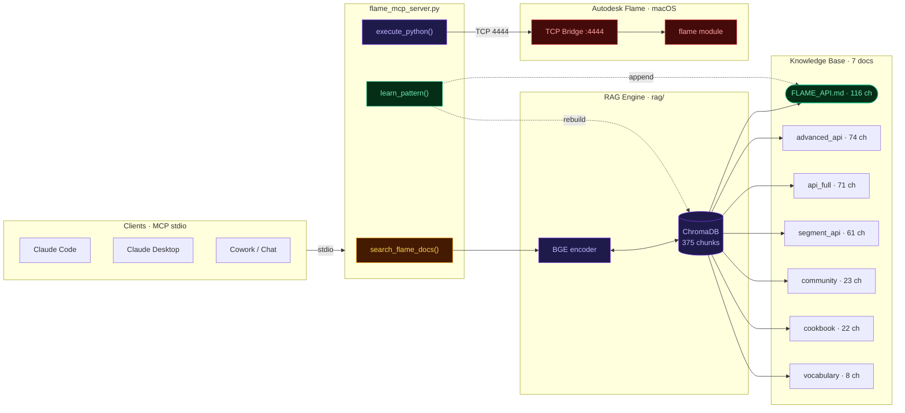
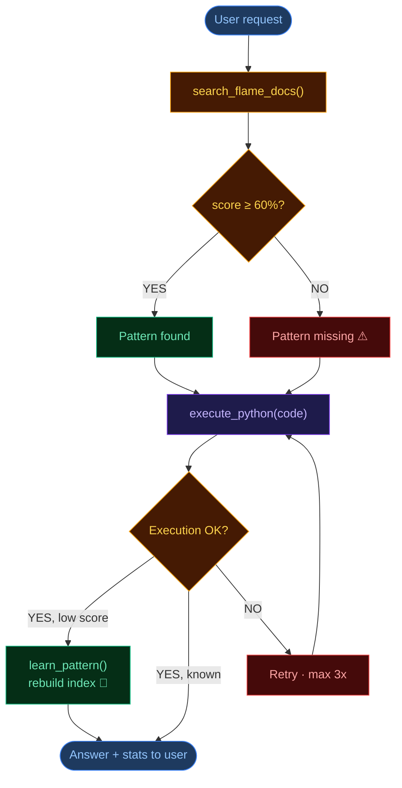

# flame-mcp — Architecture & Query Flow

## System architecture

| Block | File | Role |
|---|---|---|
| **Claude** | — | Understands the request, calls MCP tools, generates Python code |
| **MCP Server** | `flame_mcp_server.py` | Exposes tools (`execute_python`, `search_flame_docs`, `learn_pattern`), routes RAG queries |
| **BGE encoder** | `rag/` | BAAI/bge-small-en-v1.5 · converts query to vector for similarity search |
| **ChromaDB** | `rag/chroma_db/` | Vector store · 375 chunks indexed across 7 source docs |
| **FLAME_API.md** | `FLAME_API.md` | Cheatsheet · self-extended by `learn_pattern()` after every successful undocumented call |
| **TCP Bridge** | `hooks/flame_mcp_bridge.py` | Flame Python hook · TCP server on port 4444 · executes code inside Flame's interpreter |

---

## Query flow & decision tree

---

## Self-improving loop

Every successful `execute_python` call where RAG scored < 60% triggers `learn_pattern()`:

1. Working code appended as a structured block in `FLAME_API.md`
2. ChromaDB index rebuilt in background (~8 s)
3. Next session — same query returns > 70% relevance, no retries

---

## Knowledge base — 375 chunks across 7 source docs

| File | Chunks | Content |
|---|---|---|
| `FLAME_API.md` | 116 | Core API + self-learned patterns (auto-extended by `learn_pattern`) |
| `docs/flame_advanced_api.md` | 74 | Action, Color Management, Exporter, Conform/AAF, Timeline FX/BFX |
| `docs/flame_api_full.md` | 71 | PySequence, PyTrack, PyVersion, PyMarker, PyProject, PyWorkspace |
| `docs/flame_segment_timeline_api.md` | 61 | PySegment, PyClip.render(), PyBatch.create_batch_group() |
| `docs/flame_community_workflows.md` | 23 | Logik Forum operator jargon → API mapping |
| `docs/flame_cookbook_official.md` | 22 | Official Autodesk Python code samples |
| `docs/flame_vocabulary.md` | 8 | Operator terminology glossary |

> **Token economics:** RAG injects ~600 tokens per query vs ~38,000 for the full doc. Typical session saving: **80–85%**.
