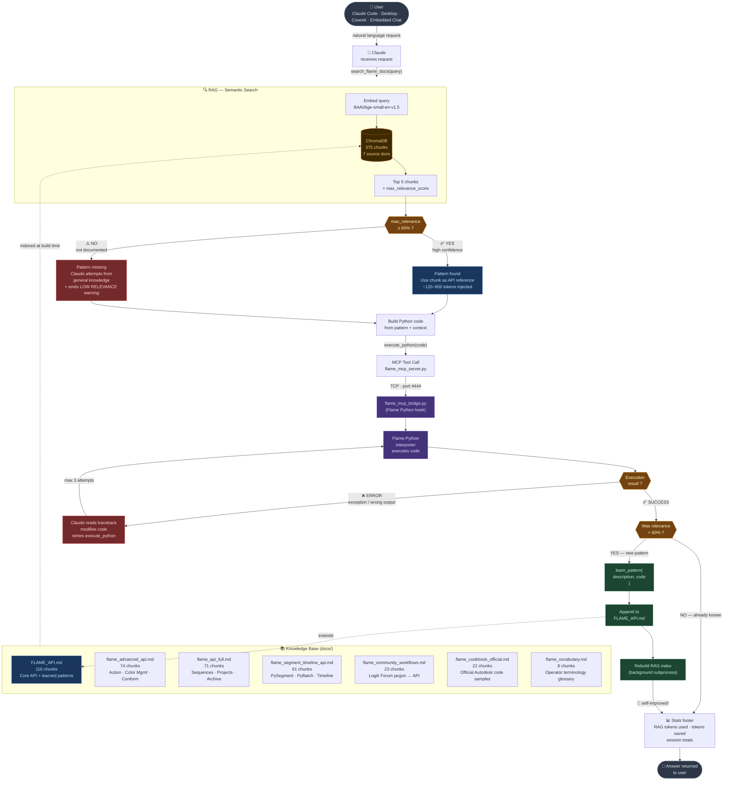

# flame-mcp — Architecture & Query Flow

## System blocks

```
┌──────────────────┐    MCP (stdio)    ┌──────────────────────┐    TCP 4444    ┌─────────────────┐
│  Claude Code /   │ ◄──────────────── │   flame_mcp_server   │ ◄──────────── │  Autodesk Flame │
│  Claude Desktop  │ ─────────────────►│   (Python, macOS)    │ ─────────────►│  Python bridge  │
│  Cowork / Chat   │                   │  + ChromaDB RAG       │                │  flame module   │
└──────────────────┘                   └──────────────────────┘                └─────────────────┘
```

| Block | File | Role |
|---|---|---|
| **Claude** | — | Understands the request, calls MCP tools, generates Python code |
| **MCP Server** | `flame_mcp_server.py` | Exposes tools (`execute_python`, `search_flame_docs`, `learn_pattern`), routes RAG queries |
| **TCP Bridge** | `hooks/flame_mcp_bridge.py` | Flame Python hook, TCP server on port 4444, executes code inside Flame's interpreter |
| **RAG Engine** | `rag/` | ChromaDB + BGE embeddings, 375 chunks across 7 source docs |

---

## Query flow & decision tree



---

## Self-improving loop

Every successful `execute_python` call where RAG scored < 60% triggers `learn_pattern()`:

1. Working code is appended as a structured block in `FLAME_API.md`
2. The ChromaDB index is rebuilt in a background subprocess (~8 s)
3. Next session the same query returns > 70% relevance — no retries, no guessing

---

## Knowledge base — 375 chunks across 7 source docs

| File | Chunks | Content |
|---|---|---|
| `FLAME_API.md` | 116 | Core API + self-learned patterns (auto-extended by `learn_pattern`) |
| `docs/flame_advanced_api.md` | 74 | Action, Color Management, Exporter, Conform/AAF, Timeline FX/BFX |
| `docs/flame_api_full.md` | 71 | PySequence, PyTrack, PyVersion, PyMarker, PyProject, PyWorkspace |
| `docs/flame_segment_timeline_api.md` | 61 | PySegment, PyClip.render(), PyBatch.create_batch_group() |
| `docs/flame_community_workflows.md` | 23 | Logik Forum jargon → API mapping |
| `docs/flame_cookbook_official.md` | 22 | Official Autodesk Python code samples |
| `docs/flame_vocabulary.md` | 8 | Operator terminology glossary |

> Token economics: RAG injects ~600 tokens per query vs ~38,000 for the full doc. Typical session saving: **80–85%**.
