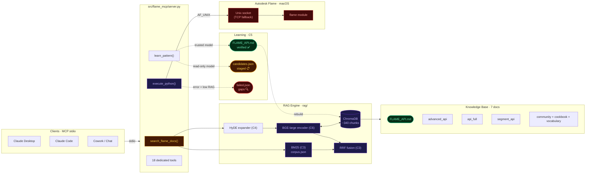
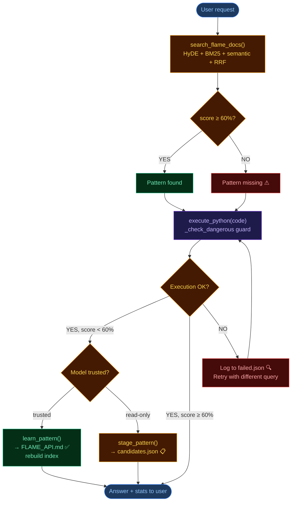

# flame-mcp — Architecture & Query Flow

## System architecture

```mermaid
flowchart LR
    subgraph CLI["Clients  ·  MCP stdio"]
        A1["Claude Desktop"]
        A2["Claude Code"]
        A3["Cowork / Chat"]
    end

    subgraph SRV["src/flame_mcp/server.py"]
        T1["search_flame_docs()"]
        T2["execute_python()"]
        T3["learn_pattern()"]
        T4["18 dedicated tools"]
    end

    subgraph RAG["RAG Engine  ·  rag/"]
        R1["HyDE expander (C4)"]
        R2["BGE-large encoder (C6)"]
        R3[("ChromaDB\n~340 chunks")]
        R4["BM25 (C3)\ncorpus.json"]
        R5["RRF fusion (C3)"]
    end

    subgraph KB["Knowledge Base  ·  7 docs"]
        K1(["FLAME_API.md"])
        K2["advanced_api"]
        K3["api_full"]
        K4["segment_api"]
        K5["community + cookbook + vocabulary"]
    end

    subgraph C5["Learning  ·  C5"]
        L1(["FLAME_API.md\nverified ✅"])
        L2(["candidates.json\nstaged 📋"])
        L3(["failed.json\ngaps 🔍"])
    end

    subgraph FLM["Autodesk Flame  ·  macOS"]
        B1["Unix socket\n(TCP fallback)"]
        B2["flame module"]
    end

    CLI  -->|"stdio"| SRV
    T1   --> R1
    R1   --> R2
    R2  <--> R3
    R3   --> KB
    T1   --> R4
    R4   --> R5
    R2   --> R5
    T2   -->|"AF_UNIX"| B1
    B1   --> B2
    T3  -.->|"trusted model"| L1
    T3  -.->|"read-only model"| L2
    T2  -.->|"error + low RAG"| L3
    L1  -.->|"rebuild"| R3

    style K1 fill:#052e16,color:#6ee7b7,stroke:#10b981
    style L1 fill:#052e16,color:#6ee7b7,stroke:#10b981
    style L2 fill:#451a03,color:#fcd34d,stroke:#f59e0b
    style L3 fill:#450a0a,color:#fca5a5,stroke:#ef4444
    style R3 fill:#1e1b4b,color:#c4b5fd,stroke:#7c3aed
    style R2 fill:#1e1b4b,color:#c4b5fd,stroke:#7c3aed
    style R4 fill:#1e1b4b,color:#c4b5fd,stroke:#7c3aed
    style R5 fill:#1e1b4b,color:#c4b5fd,stroke:#7c3aed
    style T2 fill:#1e1b4b,color:#c4b5fd,stroke:#7c3aed
    style T1 fill:#451a03,color:#fcd34d,stroke:#f59e0b
    style B1 fill:#450a0a,color:#fca5a5,stroke:#ef4444
    style B2 fill:#450a0a,color:#fca5a5,stroke:#ef4444
```

| Block | File | Role |
|---|---|---|
| **Claude** | — | Understands the request, calls MCP tools, generates Python code |
| **MCP Server** | `src/flame_mcp/server.py` | 20+ tools: `execute_python`, `search_flame_docs`, `learn_pattern`, 18 dedicated tools |
| **HyDE expander** | `rag/search.py` | C4 — wraps query in a Flame code template before embedding; bridges NL ↔ code gap |
| **BGE-large encoder** | `rag/` | BAAI/bge-large-en-v1.5 (~570 MB) · higher accuracy on exact API method names (C6) |
| **BM25** | `rag/search.py` + `rag/corpus.json` | C3 — exact-match lexical retrieval; excels at `PyExporter`, `schedule_idle_event`, etc. |
| **RRF fusion** | `rag/search.py` | C3 — Reciprocal Rank Fusion merges BM25 + semantic ranked lists (k=60) |
| **ChromaDB** | `rag/index/` | Vector store · ~340 chunks across 7 source docs |
| **FLAME_API.md** | `FLAME_API.md` | Core cheatsheet · extended by `learn_pattern()` (trusted models only) |
| **Unix socket bridge** | `hooks/flame_mcp_bridge.py` | AF_UNIX socket `run/flame_mcp.sock` (owner-only); TCP :4444 fallback |

---

## Query flow & decision tree

```mermaid
flowchart TD
    A(["User request"])
    B["search_flame_docs()\nHyDE + BM25 + semantic + RRF"]
    C{"score ≥ 60%?"}
    D["Pattern found"]
    E["Pattern missing ⚠"]
    F["execute_python(code)\n_check_dangerous guard"]
    G{"Execution OK?"}
    H{"Model trusted?"}
    H1["learn_pattern()\n→ FLAME_API.md ✅\nrebuild index"]
    H2["stage_pattern()\n→ candidates.json 📋"]
    I["Log to failed.json 🔍\nRetry with different query"]
    J(["Answer + stats to user"])

    A --> B
    B --> C
    C -->|YES| D
    C -->|NO| E
    D --> F
    E --> F
    F --> G
    G -->|"YES, score < 60%"| H
    G -->|"YES, score ≥ 60%"| J
    G -->|NO| I
    H -->|trusted| H1
    H -->|read-only| H2
    H1 --> J
    H2 --> J
    I --> F

    style A fill:#1e3a5f,color:#93c5fd,stroke:#3b82f6
    style B fill:#451a03,color:#fcd34d,stroke:#f59e0b
    style C fill:#451a03,color:#fcd34d,stroke:#f59e0b
    style D fill:#052e16,color:#6ee7b7,stroke:#10b981
    style E fill:#450a0a,color:#fca5a5,stroke:#ef4444
    style F fill:#1e1b4b,color:#c4b5fd,stroke:#7c3aed
    style G fill:#451a03,color:#fcd34d,stroke:#f59e0b
    style H fill:#451a03,color:#fcd34d,stroke:#f59e0b
    style H1 fill:#052e16,color:#6ee7b7,stroke:#10b981
    style H2 fill:#451a03,color:#fcd34d,stroke:#f59e0b
    style I fill:#450a0a,color:#fca5a5,stroke:#ef4444
    style J fill:#1e3a5f,color:#93c5fd,stroke:#3b82f6
```

---

## Self-improving loop (C5 — 3-level learning)

Every successful `execute_python` call where RAG scored < 60% triggers `learn_pattern()`:

| Model tier | Outcome | Storage |
|---|---|---|
| Trusted (Sonnet / Opus) | Pattern appended to `FLAME_API.md`, index rebuilt in background | `FLAME_API.md` — verified ✅ |
| Read-only (Qwen, Llama…) | Pattern staged for human review | `rag/candidates.json` — candidate 📋 |
| Any model, exec failed | Error + query logged as knowledge gap | `rag/failed.json` — failed 🔍 |

`candidates.json` can be promoted to `FLAME_API.md` by a trusted model in a later session.
`failed.json` (capped at 100 entries) identifies topics where the knowledge base needs enrichment.

---

## Knowledge base — ~340 chunks across 7 source docs

| File | Chunks | Content |
|---|---|---|
| `FLAME_API.md` | ~73 | Core API + self-learned patterns (auto-extended by `learn_pattern`) |
| `docs/flame_advanced_api.md` | ~78 | Action, Color Management, Exporter (safe export pattern), Conform/AAF, Timeline FX/BFX |
| `docs/flame_api_full.md` | ~71 | PySequence, PyTrack, PyVersion, PyMarker, PyProject, PyWorkspace |
| `docs/flame_segment_timeline_api.md` | ~61 | PySegment, PyClip.render(), PyBatch.create_batch_group() |
| `docs/flame_community_workflows.md` | ~23 | Logik Forum operator jargon → API mapping |
| `docs/flame_cookbook_official.md` | ~22 | Official Autodesk Python code samples |
| `docs/flame_vocabulary.md` | ~8 | Operator terminology glossary |

> **Token economics:** RAG injects ~600 tokens per query vs ~38,000 for the full doc. Typical session saving: **80–85%**.
> BM25 adds zero embedding cost — pure token matching over `corpus.json`.

---

## Safety guards (execute_python)

`_check_dangerous()` blocks code patterns known to crash or hang Flame before execution:

| Pattern | Risk | Enforced by |
|---|---|---|
| `flame.batch.render()` | Blocks main thread | Regex + AST |
| `PyExporter().export()` without `schedule_idle_event` | Deadlock hang | Regex |
| `import wiretap` | Crash-prone C bindings | Regex + AST |
| `ws.replace_desktop()` | Corrupts workspace state | Regex |
| `.clear()` on Flame objects | C-level destructor crash | Regex |
| `flame.projects[n]` | PyProjectSelector not subscriptable | Regex |
| `.name == "…"` without `str()` | PyAttribute silent comparison failure | Regex |
| `next(… for …)` without default | StopIteration on no match | Regex |
| `dir(flame…)` | Triggers speculative/hallucinated code | Regex |

All blocks include the correct alternative pattern in the error message.
