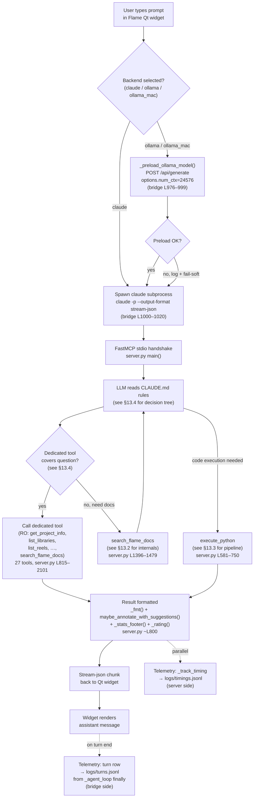
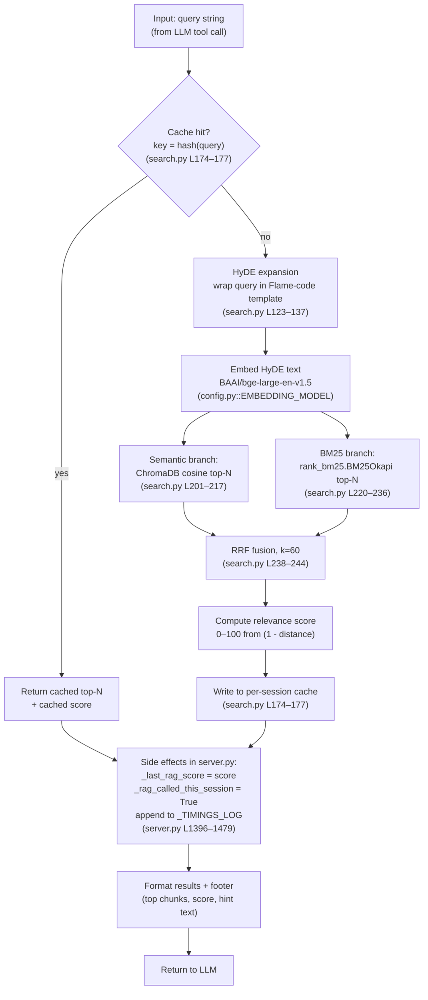
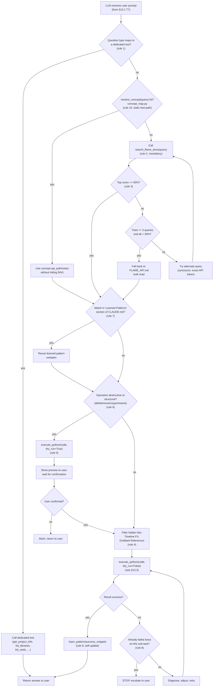
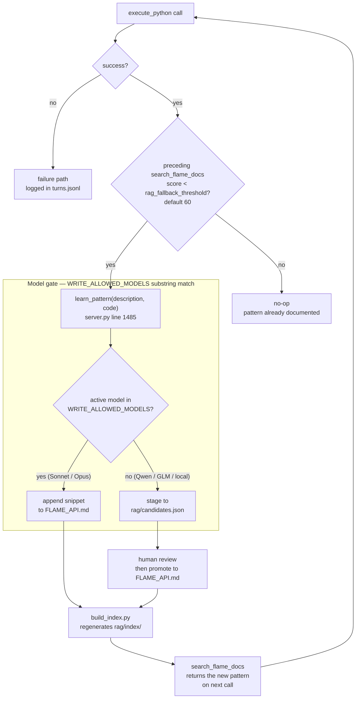
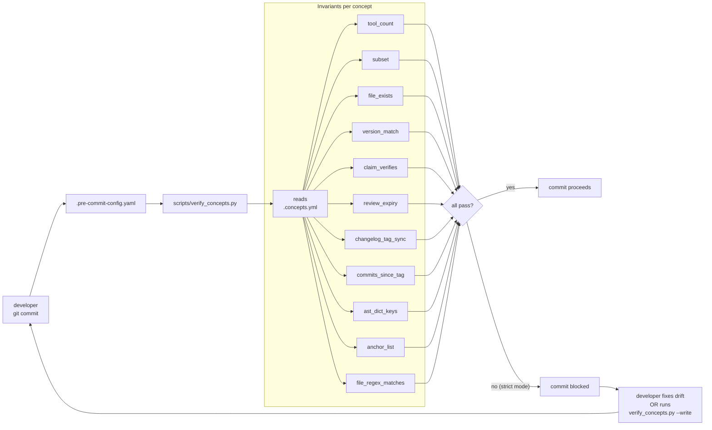

# flame-mcp — Architecture (as found in code)

> **Scope.** This document describes the system that actually runs when
> `flame-mcp` is installed. It is the **ground truth** against which README
> marketing copy, CLAUDE.md behavioural rules, and in-code docstrings are
> audited. When this file and code disagree, the code wins and this file
> is the one that needs fixing — track any divergence as a drift entry in
> `.concepts.yml`.
>
> Last authored after the Chat 44 reverse-engineering pass (four read-only
> audit agents). Extended in Chat 51 (sections §13–§16) with the granular
> request flow, the parallel self-learning loops, the pre-designed elements
> catalogue, and the uniqueness analysis vs a stock MCP server. Regenerate
> whenever `src/flame_mcp/server.py` or `hooks/flame_mcp_bridge.py` changes
> in a structural way (a new tool, a different transport, a new backend,
> a new config key) — or when a new pre-designed element is introduced and
> §15 needs a row.

---

## 1. Overview

`flame-mcp` is an **MCP server** for Autodesk Flame. It exposes 27 tools
over MCP stdio and implements them by sending Python snippets to a hook
running inside Flame over a local Unix-domain socket (TCP port 4444 as
fallback). A RAG index over the Flame Python API and a suite of curated
`docs/*.md` files is consulted before every freeform code execution to
keep the agent on documented API paths.

## 2. Process model

Two processes cooperate; they share `config.json` on disk but no memory:

```
 +------------------------------+            +------------------------------+
 |  MCP server (this repo)      |            |  Flame (Autodesk binary)     |
 |  .venv/bin/python -m flame_  |  socket    |  Python 3.11.5 embedded      |
 |  mcp.server  (stdio to MCP   | ---------> |  hooks/flame_mcp_bridge.py   |
 |  client: Claude Code,        |  JSONL     |  loaded as a user hook at    |
 |  Desktop, Cowork, etc.)      |            |  /opt/Autodesk/shared/...    |
 +------------------------------+            +------------------------------+
```

- **Entry point**: `[project.scripts] flame-mcp = "flame_mcp.server:main"`.
  Inside the module, `mcp = FastMCP("flame", ...)`; `mcp.run(transport="stdio")`.
  Before run, `_sync_tool_permissions()` AST-parses this very file to register
  tool approvals into `~/.claude/settings.json`.
- **Flame hook**: file at `hooks/flame_mcp_bridge.py`. A symlink at
  `/opt/Autodesk/shared/python/flame_mcp_bridge.py` (created once by
  `install.sh`) lets every `git pull` deploy updates without copying.
  Flame calls the hook's `app_initialized(project_name)` callback on
  startup, which starts a socket server in a daemon thread.

## 3. Transport

- **Unix domain socket** at `<repo>/run/flame_mcp.sock` (or
  `/tmp/flame_mcp.sock` when the repo path is not resolvable inside Flame).
  Override with `FLAME_BRIDGE_SOCKET` env var.
- **TCP port 4444** is the fallback when `AF_UNIX` is unavailable. Override
  with `FLAME_BRIDGE_PORT`. In practice macOS always has `AF_UNIX` and the
  TCP path is exercised only on exotic platforms.
- **Wire format**: one JSON object per line. Client -> bridge:
  `{"code": "<python>"}` (optionally prefixed with `# DT\n` to mark the
  call as originating from a dedicated tool and skip the bridge-side
  redirect safety check). Bridge -> client:
  `{"status": "success"|"error", "output": "...", "return_value": "..."}`.

## 4. Module layout

```
src/flame_mcp/
├── server.py              <- MCP entry; 26 @mcp.tool decorators; socket client
├── safety.py              <- _DANGEROUS_PATTERNS, _REDIRECT_PATTERNS
├── journal.py             <- Journal + UndoCodeGenerator (operation history)
├── concept_map.py         <- static user-intent -> API resolver (resolve_concept)
└── rag/
    ├── build_index.py     <- corpus chunking + ChromaDB build + BM25 prep
    ├── search.py          <- hybrid BM25 + semantic via RRF; HyDE query expansion
    ├── config.py          <- EMBEDDING_MODEL = "BAAI/bge-large-en-v1.5"
    └── validate_index.py  <- smoke tests for the built index

hooks/
└── flame_mcp_bridge.py    <- Flame-side socket server + Qt chat widget + LLM
                             backend selection (model combo, preflight num_ctx)

rag/
├── corpus.json            <- 783 chunks extracted from FLAME_API.md + docs/*.md
└── index/                 <- ChromaDB persistent store (gitignored)
```

No circular imports.

## 5. Runtime flow — `list_libraries()` end-to-end

1. Claude Code (stdio) calls the `list_libraries` MCP tool.
2. `server.py::list_libraries()` (around line 876) builds a hardcoded Python
   snippet and calls `_call_flame(code, dedicated_tool=True)`.
3. `_call_flame` prepends `# DT\n` so the bridge recognises it as trusted
   and skips the redirect-pattern safety check.
4. The server connects to the Unix socket (or TCP 4444 fallback) and writes
   the JSON line.
5. Bridge `_handle_connection()` reads the line, detects `# DT`, strips it,
   and executes the payload in Flame's embedded Python (`exec()` inside a
   sandbox that exposes `flame`, `cmds`, `json`, etc.).
6. The return value is JSON-marshalled and written back on the same socket.
7. `_call_flame` returns the dict; `_fmt()` formats it and appends
   `_stats_footer()` (token counters, RAG savings, call count). `_rating()`
   skips the 🟡/🔴 icons when the current backend starts with `ollama`.
8. Claude Code receives the MCP tool output.

## 6. RAG subsystem

- **Build time** (`rag/build_index.py`): reads 14 documents listed in the
  README "Knowledge base" table + `FLAME_API.md`. Splits into chunks at
  semantic sentence boundaries, embeds with
  `BAAI/bge-large-en-v1.5`, and writes both a BM25 index and a ChromaDB
  persistent store at `rag/index/`.
- **Search time** (`rag/search.py`): hybrid retrieval — BM25 (exact method
  names) + semantic (synonyms) combined via Reciprocal Rank Fusion. A HyDE
  query expansion wraps the query in a Flame-code template before embedding
  to improve recall on natural-language questions.
- **Score**: 0–100. Tools record `_last_rag_score` to gate `execute_python`
  (see §7 "RAG gate"). Below the threshold (default 60, configurable via
  `config.json -> rag_fallback_threshold`) the server warns the user that
  the code may be undocumented.
- **Self-healing**: after a successful `execute_python` whose preceding
  `search_flame_docs` scored below threshold, if the active model is in
  `WRITE_ALLOWED_MODELS` (Sonnet/Opus substring match), `learn_pattern()`
  appends the code pattern to `FLAME_API.md` and rebuilds the index. For
  read-only models the pattern is staged in `rag/candidates.json` instead.

## 7. Safety & redirect enforcement

- **`_DANGEROUS_PATTERNS`** (`safety.py`): regexes that flag destructive or
  system-level operations; matched at both server entry and bridge entry
  so the bridge is never trusted alone.
- **`_REDIRECT_PATTERNS`** (`safety.py`): patterns that indicate the LLM
  should have used a dedicated tool (e.g. listing libraries via raw code
  instead of `list_libraries()`). Bridge writes mismatches to
  `/tmp/flame_mcp_redirect.log` and rejects the call unless the code carries
  the `# DT` marker.
- **RAG gate** (`server.py::execute_python`): if the most recent
  `search_flame_docs` score is `< rag_fallback_threshold`, `execute_python`
  refuses to run and returns a structured error that prompts the LLM to
  consult more specific docs first. Tracked by `_OBS_013`.
- **Dry run**: `execute_python(dry_run=True)` runs the safety checks and
  returns the report without executing.

## 8. LLM backend selection (lives in the hook, not the server)

- **`AVAILABLE_MODELS`** (`hooks/flame_mcp_bridge.py`) is a list of
  `(display_name, model_id, backend)` tuples. Current entries:
  `claude-fable-5`, `claude-opus-4-8`, `claude-sonnet-4-6` (anthropic); `qwen3.5-mcp`,
  `glm-4.7-flash` (ollama, LAN GPU — glm-4.7-flash is NOT recommended, tool-calling
  broken in Ollama as of June 2026, issues #13820/#13840); `qwen3.5-mcp`, `qwen3.5:4b`
  (ollama_mac, local CPU/MPS).
- **Widget**: a Qt combo box in the Flame panel selects the active entry.
  The selection is persisted in `config.json -> model` + `config.json -> backend`.
- **Backend environments** (`_get_ollama_env`, lines ~1483–1514):
  - `anthropic`: reads `ANTHROPIC_API_KEY` from the environment.
  - `ollama`: sets `ANTHROPIC_BASE_URL` to `config.json -> ollama_url` and
    stubs `ANTHROPIC_API_KEY = "ollama"`.
  - `ollama_mac` / `ollama_cloud`: same as `ollama` but with
    `ANTHROPIC_BASE_URL = "http://localhost:11434"`.
- **Context-window preflight**: before the `claude` subprocess runs against
  an Ollama backend, the hook POSTs `{"options": {"num_ctx": 24576}}` to
  `/api/generate` with an empty prompt. This forces Ollama to load the
  model with the full context window; without it, Ollama's
  Anthropic-compat `/v1/messages` endpoint defaults to 4096 and ignores
  any `num_ctx` declared in the Modelfile. The preflight runs for the
  `ollama` backend only — `ollama_mac` and `ollama_cloud` currently do
  NOT get it (see §11).
- **Subprocess launch**: `_agent_loop` spawns `claude -p --output-format
  stream-json` with the backend-specific env, then streams stdout/stderr
  to the Qt chat widget.

## 9. Configuration precedence

MCP server (`server.py::_get_config`):
1. `config.json` at the repo root.
2. Silent empty dict on read error (graceful degradation).

Keys: `rag_fallback_threshold` (default 60), `fallback_model`
(default `"Sonnet"`), `write_allowed_models` (overrides
`WRITE_ALLOWED_MODELS` when non-empty).

Bridge (`flame_mcp_bridge.py::_load_model_config`):
1. Same `config.json`.
2. Hardcoded defaults: `DEFAULT_MODEL = "claude-sonnet-4-6"`,
   `DEFAULT_BACKEND = "anthropic"`,
   `DEFAULT_OLLAMA_URL = "http://localhost:11434"`.

Keys: `model`, `backend`, `ollama_url`, `ollama_cloud_key`.

Socket transport overrides (both processes):
1. Env var: `FLAME_BRIDGE_SOCKET`, `FLAME_BRIDGE_PORT`.
2. Repo-relative path (if detectable).
3. `/tmp` / TCP fallback.

Model selection has **no** env var override — this asymmetry with transport
is undocumented user-facing but is a known trait of the code (see §11).

## 10. Logging & telemetry

- `_stats` dict (`server.py`, ~line 117): exec calls, tokens in/out,
  tokens saved by RAG, tokens saved by dedicated tools, patterns learned.
  Token counts are character-count estimates (`len(text) // 3`), not real
  Anthropic API counters.
- `_stats_footer()` appends the stats to every tool response; `_rating()`
  adds 🟢/🟡/🔴 badges **only for Anthropic backends** — Ollama is suppressed
  (implemented in Chat 44 to match the long-standing README claim).
- `logs/flame_rag.log` (search queries and scores), `logs/flame_mcp_bridge.log`
  (bridge events, model changes, preflight results), `logs/crash_recovery.json`
  (last `execute_python` snapshot for post-crash diagnostics, 24 h TTL).
- `session_stats()` tool exposes the counters to the LLM for
  self-diagnosis. Stats are **process-global** and are NOT reset when a
  Claude session ends — they accumulate until the MCP server restarts.

## 11. Known architectural smells (carry-forward from Chat 44 audit)

The following are documented, not fixed. They are not bugs per se —
several are deliberate trade-offs — but fresh Claude sessions should know
about them before "fixing" something that looks off.

- **Silent failure when the RAG index is missing.** `search.py` returns
  `None` and logs only to file; the caller degrades gracefully but the
  user never sees the error.
- **`_load_model_config` extracted to shared helper.** Chat 44 audit
  flagged the bridge's `_load_model_config` as a dedup candidate
  against the server's `_get_config`. Investigation confirmed they
  are not in fact identical — `_get_config` returns the raw dict of
  the server-centric keys (`rag_fallback_threshold`,
  `write_allowed_models`, …) while `_load_model_config` extracts the
  four widget-facing keys (`model`, `backend`, `ollama_url`,
  `ollama_cloud_key`) with typed defaults. The widget-facing logic
  now lives in `src/flame_mcp/_config.py::load_model_config()`; the
  bridge delegates to it (with an inline fallback for installs
  without the repo on disk). No server-side change needed as the
  server never read those four keys in the first place.
- **Env-var vs config.json asymmetry**: transport settings are env-first,
  model settings are config-first. Undocumented in user-facing README.
- **Backend-specific timeouts are hardcoded** (600 s for `ollama`, 300 s
  for `ollama_cloud`) with no config override.
- **Crash-recovery TTL of 24 h is hardcoded** (`crash_recovery.json`).
- **`_stats` per-session reset — helper landed, server wiring pending.**
  `src/flame_mcp/_session_stats.py` exports `make_empty_stats()`,
  `should_auto_reset()`, `apply_idle_reset()` and `reset_stats()` — the
  pure logic that zeroes the counters either on an idle-gap trigger
  (default 30 min) or on an explicit `reset_session_stats` call.
  MCP over stdio exposes no reliable "Claude session boundary" to the
  server (no `client_id` populated by Claude Code, no
  `initialize`-notification hook on reconnect), so those two triggers
  are the pragmatic substitute. See `docs/session_stats_reset.md` for
  the full design + server.py patch proposal. Patch not applied yet —
  server.py edits require the main session per
  `feedback_agent_file_safety.md`.
- **`ollama_mac` skips the num_ctx preflight** that the `ollama` backend
  gets. In practice Mac users may see responses truncated at 4096 tokens
  silently. Not promoted to a bug because no complaint has been filed
  yet (pending targeted Mac-local benchmarking).

## 13. Granular request flow

This section traces what happens between the moment the user types a prompt in the
Flame Qt widget and the moment Flame shows the result of executing the right Python.
It is the granular complement of §§ 1–4 (process model, transport, tools) and §§ 5–7
(RAG, safety, suggestions): nothing here is repeated from earlier sections, every
diamond is a real decision in the code, and every diagram node is followed by a
file/line reference.

Read order:
- §13.1 top-level orchestration (Qt widget → claude subprocess → MCP tool → response).
- §13.2 RAG internal flow (what `search_flame_docs` does between input and footer).
- §13.3 `execute_python` pipeline (server gates → socket → bridge → exec → response).
- §13.4 LLM decision tree (`flame-mcp/CLAUDE.md` rules expressed as a state machine).

Node-code convention:
- `T*` = top-level (§13.1).
- `R*` = RAG (§13.2).
- `E*` = execute_python (§13.3).
- `D*` = LLM decision (§13.4).

### 13.1 Top-level orchestration

This is the outer loop. It starts in the Flame-embedded Qt widget and ends when the
chat panel has rendered the assistant's last `stream-json` chunk. Every box maps to
real code in `hooks/flame_mcp_bridge.py` or `src/flame_mcp/server.py`.

Inline references:
- Widget chat button → `_agent_loop` (`hooks/flame_mcp_bridge.py`, lines 898–1050).
- Ollama preflight → `_preload_ollama_model` (`hooks/flame_mcp_bridge.py`, lines 976–999).
- Claude subprocess spawn → inside `_agent_loop` after preflight (`hooks/flame_mcp_bridge.py` ~lines 1000–1020).
- MCP tool dispatch → FastMCP stdio in `src/flame_mcp/server.py` (every `@mcp.tool` decorator).
- Telemetry writes → `_track_timing` (server side, `logs/timings.jsonl`) and the outer
  `finally` of `_agent_loop` (bridge side, `logs/turns.jsonl`).
- For transport details (UDS vs TCP fallback, wire format), see §3.


```mermaid
flowchart TD
    T1["User types prompt<br/>in Flame Qt widget"]
    T2{"Backend selected?<br/>(claude / ollama / ollama_mac)"}
    T3["_preload_ollama_model()<br/>POST /api/generate<br/>options.num_ctx=24576<br/>(bridge L976–999)"]
    T4{"Preload OK?"}
    T5["Spawn claude subprocess<br/>claude -p --output-format stream-json<br/>(bridge L1000–1020)"]
    T6["FastMCP stdio handshake<br/>server.py main()"]
    T7["LLM reads CLAUDE.md rules<br/>(see §13.4 for decision tree)"]
    T8{"Dedicated tool<br/>covers question?<br/>(see §13.4)"}
    T9["Call dedicated tool<br/>(RO: get_project_info,<br/>list_libraries,<br/>list_reels, …,<br/>search_flame_docs)<br/>27 tools, server.py L815–2101"]
    T10["search_flame_docs<br/>(see §13.2 for internals)<br/>server.py L1396–1479"]
    T11["execute_python<br/>(see §13.3 for pipeline)<br/>server.py L581–750"]
    T12["Result formatted<br/>_fmt() + maybe_annotate_with_suggestions()<br/>+ _stats_footer() + _rating()<br/>server.py ~L800"]
    T13["Stream-json chunk<br/>back to Qt widget"]
    T14["Telemetry: _track_timing<br/>→ logs/timings.jsonl<br/>(server side)"]
    T15["Telemetry: turn row<br/>→ logs/turns.jsonl<br/>from _agent_loop finally<br/>(bridge side)"]
    T16["Widget renders<br/>assistant message"]

    T1 --> T2
    T2 -- claude --> T5
    T2 -- ollama / ollama_mac --> T3
    T3 --> T4
    T4 -- yes --> T5
    T4 -- no, log + fail-soft --> T5
    T5 --> T6
    T6 --> T7
    T7 --> T8
    T8 -- yes --> T9
    T8 -- no, need docs --> T10
    T10 --> T7
    T9 --> T12
    T7 -- code execution needed --> T11
    T11 --> T12
    T12 --> T13
    T12 -.parallel.-> T14
    T13 --> T16
    T16 -.on turn end.-> T15
```

Notes on T3 (Ollama preflight):
- Only runs for `ollama` and `ollama_mac` backends. The `claude` backend skips it.
- The empty-prompt POST forces Ollama to load the model with `num_ctx=24576`
  before the real turn starts. Without it, Ollama's Anthropic-compat endpoint
  silently caps context to 4096 and the LLM truncates the system prompt.
- It is fail-soft: if the preload errors, the turn still proceeds (degraded).

Notes on T8 (dedicated tool vs `execute_python`):
- The decision lives in the LLM, driven by `flame-mcp/CLAUDE.md`. See §13.4.
- `_rating()` is suppressed when the backend is Ollama (smaller models tend
  to hallucinate the rubric), but the rest of the footer pipeline still runs.

Notes on T14/T15 (parallel telemetry):
- Server-side `_track_timing` is per-tool-call; it fires regardless of which
  branch (T9, T10, T11) ran.
- Bridge-side turn rows fire from the outer `finally` of `_agent_loop`, so a
  timeout or claude-subprocess crash still produces a turn row with
  `failed_turns` incremented (feeds `p_fallo = failed_turns / turns_total`,
  see F0 telemetry on `feat/f0-baseline-instrumentation`).

### 13.2 RAG internal flow (`search_flame_docs`)

This zooms inside node T10. The tool is `search_flame_docs`
(`src/flame_mcp/server.py` lines 1396–1479) and delegates the heavy lifting to
`src/flame_mcp/rag/search.py`. The corpus is 783 chunks across FLAME_API.md and
14 supplementary docs (see README "Knowledge base" and `rag/corpus.json`).

Inline references:
- Embedding model `BAAI/bge-large-en-v1.5` (`rag/config.py::EMBEDDING_MODEL`).
- ChromaDB `PersistentClient` (`rag/search.py` line 74).
- HyDE expansion (`rag/search.py` lines 123–137).
- Semantic search (`rag/search.py` lines 201–217).
- BM25 parallel branch (`rag/search.py` lines 220–236).
- RRF fusion, k=60 (`rag/search.py` lines 238–244).
- Per-session cache, key=`hash(query)` (`rag/search.py` lines 174–177).
- Side effects in `server.py`: sets `_last_rag_score`, sets
  `_rag_called_this_session=True`, writes `_TIMINGS_LOG`, returns formatted
  results plus footer.
- Static fast-path: `concept_map.py::resolve_concept(query)` (keyword lookup,
  no embeddings) is consulted by the LLM rules before falling back to full RAG.


```mermaid
flowchart TD
    R1["Input: query string<br/>(from LLM tool call)"]
    R2{"Cache hit?<br/>key = hash(query)<br/>(search.py L174–177)"}
    R3["Return cached top-N<br/>+ cached score"]
    R4["HyDE expansion<br/>wrap query in Flame-code template<br/>(search.py L123–137)"]
    R5["Embed HyDE text<br/>BAAI/bge-large-en-v1.5<br/>(config.py::EMBEDDING_MODEL)"]
    R6["Semantic branch:<br/>ChromaDB cosine top-N<br/>(search.py L201–217)"]
    R7["BM25 branch:<br/>rank_bm25.BM25Okapi top-N<br/>(search.py L220–236)"]
    R8["RRF fusion, k=60<br/>(search.py L238–244)"]
    R9["Compute relevance score<br/>0–100 from (1 - distance)"]
    R10["Write to per-session cache<br/>(search.py L174–177)"]
    R11["Side effects in server.py:<br/>_last_rag_score = score<br/>_rag_called_this_session = True<br/>append to _TIMINGS_LOG<br/>(server.py L1396–1479)"]
    R12["Format results + footer<br/>(top chunks, score, hint text)"]
    R13["Return to LLM"]

    R1 --> R2
    R2 -- yes --> R3 --> R11
    R2 -- no --> R4
    R4 --> R5
    R5 --> R6
    R5 --> R7
    R6 --> R8
    R7 --> R8
    R8 --> R9
    R9 --> R10
    R10 --> R11
    R11 --> R12
    R12 --> R13
```

Why both branches:
- Semantic catches paraphrases ("how do I duplicate a clip" ≈ docs that say
  "copy media"); BM25 catches exact API tokens (`PyClip.duplicate`,
  `wiretap_tree`) that embeddings can blur.
- RRF with k=60 is the standard fusion constant; it is implemented inline in
  `rag/search.py` lines 238–244 (no external dependency).

The `_last_rag_score` track:
- `search_flame_docs` always writes the fused top-1 score into a module-level
  `_last_rag_score`.
- `execute_python` does NOT consume the score directly today — its gate
  (§13.3, E3) only checks the boolean `_rag_called_this_session`. The score
  is exposed in telemetry and in the result footer so the LLM can decide,
  per `CLAUDE.md` rule 3, to retry with alternate queries if score < 60%
  before falling back to FLAME_API.md at score < 30%.

### 13.3 `execute_python` pipeline

This zooms inside node T11 — the most security-sensitive path. Four
server-side gates before any code leaves the MCP process, then socket
transport, then two bridge-side safeguards (redirect mirror + crash-recovery
snapshot), then `exec()` inside Flame's embedded Python.

Inline references (all in `src/flame_mcp/server.py` unless noted):
- Entry: `execute_python` (lines 581–750).
- Gate 1 — `_check_dangerous(code)` against `_DANGEROUS_PATTERNS` from
  `safety.py` (line 630). Hard block on module imports, file I/O, shell
  escapes.
- Gate 2 — `_REDIRECT_PATTERNS` hard + `_SOFT_REDIRECT_PATTERNS` soft
  (lines 646–664). Soft is suppressed when creation intent is detected.
- Gate 3 — RAG mandatory gate (lines 670–682). Refuses to run if
  `_rag_called_this_session == False`. Returns structured error so the
  LLM can self-correct.
- Gate 4 — `dry_run=True` short-circuit (lines 684–704). Returns safety,
  redirect, and RAG status without executing.
- Socket send: `_call_flame(code, timeout, dedicated_tool=False)`
  (line 725). UDS preferred, TCP 4444 fallback (see §3).
- Bridge entry: socket server in `hooks/flame_mcp_bridge.py` lines 310–370.
- Bridge-side redirect mirror: `flame_mcp_bridge.py` lines 154–204.
  Skipped when wire payload is prefixed `# DT\n` (dedicated tools, see §3).
- Crash-recovery snapshot: `flame_mcp_bridge.py` lines 216–269. 24-hour
  TTL, cleared on success, surfaced via `get_crash_recovery_info` tool.
- `exec()` with pre-loaded names (`flame`, `cmds`, `json`, …) in the
  bridge's exec namespace.
- Server post-processing: `_fmt()` → `maybe_annotate_with_suggestions()`
  → `_stats_footer()` → `_rating()` (suppressed for Ollama) → telemetry
  persist (lines 800–811).


```mermaid
flowchart TD
    E1["execute_python(code, dry_run=False)<br/>server.py L581"]
    E2{"_check_dangerous(code)?<br/>_DANGEROUS_PATTERNS<br/>(server.py L630, safety.py)"}
    EBLOCK1["HARD BLOCK<br/>return safety error"]
    E3{"_REDIRECT_PATTERNS hit?<br/>(hard, L646–664)"}
    E4{"_SOFT_REDIRECT_PATTERNS hit?<br/>and no creation intent?"}
    EBLOCK2["HARD BLOCK<br/>return redirect error<br/>(suggest dedicated tool)"]
    EWARN["Annotate result<br/>with soft redirect hint<br/>(does NOT block)"]
    E5{"_rag_called_this_session?<br/>RAG mandatory gate<br/>(L670–682)"}
    EBLOCK3["HARD BLOCK<br/>'Call search_flame_docs first'<br/>structured error"]
    E6{"dry_run == True?<br/>(L684–704)"}
    EDRY["Return preview:<br/>safety OK + redirect OK<br/>+ RAG OK, no execution"]
    E7["_call_flame(code, timeout)<br/>(L725) → socket send"]
    E8{"UDS available?<br/>(see §3)"}
    E9["Send via UDS<br/>FLAME_BRIDGE_SOCKET<br/>or run/flame_mcp.sock"]
    E10["Fallback: TCP 4444<br/>FLAME_BRIDGE_PORT"]
    E11["Bridge receives JSON line<br/>{'code': '<python>'}<br/>(bridge L310–370)"]
    E12{"Payload starts with<br/>'# DT\\n'?<br/>(dedicated tool flag)"}
    E13["Bridge-side redirect mirror<br/>(bridge L154–204)"]
    E14{"Bridge redirect hit?"}
    EBLOCK4["Bridge returns<br/>{status:'error', output:'redirect'}"]
    E15["Write crash-recovery snapshot<br/>24h TTL<br/>(bridge L216–269)"]
    E16["exec(code, namespace)<br/>flame, cmds, json pre-loaded"]
    E17{"Exec raised?"}
    EERR["Return<br/>{status:'error', output:traceback}"]
    E18["Clear crash-recovery snapshot"]
    E19["Return<br/>{status:'success', output, return_value}"]
    E20["Server: _fmt(result)<br/>(server.py ~L800)"]
    E21["maybe_annotate_with_suggestions()<br/>see §13 prose + suggestions.py"]
    E22["_stats_footer() + _rating()<br/>(rating suppressed for Ollama)"]
    E23["persist_timing → logs/timings.jsonl<br/>(L800–811)"]
    E24["Return to LLM"]

    E1 --> E2
    E2 -- yes --> EBLOCK1
    E2 -- no --> E3
    E3 -- yes --> EBLOCK2
    E3 -- no --> E4
    E4 -- yes --> EWARN
    E4 -- no --> E5
    EWARN --> E5
    E5 -- no --> EBLOCK3
    E5 -- yes --> E6
    E6 -- yes --> EDRY
    E6 -- no --> E7
    E7 --> E8
    E8 -- yes --> E9
    E8 -- no --> E10
    E9 --> E11
    E10 --> E11
    E11 --> E12
    E12 -- yes, skip mirror --> E15
    E12 -- no --> E13
    E13 --> E14
    E14 -- yes --> EBLOCK4
    E14 -- no --> E15
    E15 --> E16
    E16 --> E17
    E17 -- yes --> EERR
    E17 -- no --> E18 --> E19
    E19 --> E20
    EERR --> E20
    EBLOCK4 --> E20
    E20 --> E21 --> E22 --> E23 --> E24
```

Why two redirect checks (server E3/E4 and bridge E13):
- The server check is the fast path and catches the common case (the LLM
  asked to do something a dedicated tool already does).
- The bridge mirror is defense-in-depth in case the wire is reached
  through a path that bypasses the server (manual socket clients, future
  alternative front-ends). The `# DT\n` prefix lets the server tell the
  bridge "this is a dedicated tool, do not redirect" without weakening
  the bridge's standalone safety posture.

Why the crash-recovery snapshot:
- Flame's embedded Python shares the process with the application. A
  long-running `exec()` that crashes Flame would otherwise leave no
  trace. The snapshot (24 h TTL) is written before exec, cleared on
  success, and surfaced by `get_crash_recovery_info`
  (`server.py` line 2055), so after a Flame relaunch the LLM can
  recover what was about to run.

### 13.4 LLM decision tree (`CLAUDE.md` rules as a state machine)

This is the layer the LLM follows on every turn. The rules are written in
`flame-mcp/CLAUDE.md` (NOT this file). They describe what the LLM must do
before each tool call. The server enforces some of them as hard gates
(see §13.3 E5), but most live as natural-language instructions to the LLM.

Mapping rules → behaviour:
1. Dedicated tool first (table in `CLAUDE.md`): project info →
   `get_project_info`, libraries → `list_libraries`, reels → `list_reels`,
   clips → `list_clips`, …, 27 tools total (`server.py` L815–2101).
   `execute_python` is the last resort.
2. Mandatory `search_flame_docs` before every `execute_python`. No
   exceptions. Server-enforced (§13.3 E5).
3. Use low-relevance RAG hits (< 60%): try 2–3 alternate queries first,
   fall back to FLAME_API.md only if all return < 30%.
4. Always filter hidden libraries `Timeline FX` and `Grabbed References`.
5. Dry-run before EVERY delete: separate inspection, user confirmation,
   then real call. No exceptions.
6. Inspect before acting for any destructive/structural op (delete, move,
   copy, rename).
7. Check Learned Patterns in `CLAUDE.md` "## Learned Patterns" before
   inventing code.
8. STOP after 2 failures — never make a 3rd `execute_python` attempt for
   the same sub-task.
9. Self-update on success — call `learn_pattern()` to extend FLAME_API.md.
10. Static fast-path: consult `concept_map.py::resolve_concept(query)`
    before RAG when the question matches a known concept keyword.


```mermaid
flowchart TD
    D1["LLM receives user prompt<br/>(from §13.1 T7)"]
    D2{"Question type maps to<br/>a dedicated tool?<br/>(rule 1)"}
    D3["Call dedicated tool<br/>(get_project_info, list_libraries,<br/>list_reels, …)"]
    D4{"resolve_concept(query) hit?<br/>concept_map.py<br/>(rule 10, static fast-path)"}
    D5["Use concept api_path/notes<br/>without hitting RAG"]
    D6["Call search_flame_docs(query)<br/>(rule 2, mandatory)"]
    D7{"Top score >= 60%?<br/>(rule 3)"}
    D8{"Tried >= 3 queries<br/>and all < 30%?"}
    D9["Try alternate query<br/>(synonyms, exact API token)"]
    D10["Fall back to FLAME_API.md<br/>bulk read"]
    D11{"Match in 'Learned Patterns'<br/>section of CLAUDE.md?<br/>(rule 7)"}
    D12["Reuse learned pattern<br/>verbatim"]
    D13{"Operation destructive or<br/>structural?<br/>(delete/move/copy/rename)<br/>(rule 6)"}
    D14["execute_python(code,<br/>dry_run=True)<br/>(rule 5)"]
    D15["Show preview to user,<br/>wait for confirmation"]
    D16{"User confirmed?"}
    D17["Abort, return to user"]
    D18["Filter hidden libs:<br/>Timeline FX,<br/>Grabbed References<br/>(rule 4)"]
    D19["execute_python(code,<br/>dry_run=False)<br/>(see §13.3)"]
    D20{"Result success?"}
    D21{"Already failed twice<br/>on this sub-task?<br/>(rule 8)"}
    D22["STOP, escalate to user"]
    D23["Diagnose, adjust, retry"]
    D24["learn_pattern(success_snippet)<br/>(rule 9, self-update)"]
    D25["Return answer to user"]

    D1 --> D2
    D2 -- yes --> D3 --> D25
    D2 -- no --> D4
    D4 -- yes --> D5 --> D11
    D4 -- no --> D6
    D6 --> D7
    D7 -- yes --> D11
    D7 -- no --> D8
    D8 -- yes --> D10 --> D11
    D8 -- no --> D9 --> D6
    D11 -- yes --> D12 --> D13
    D11 -- no --> D13
    D13 -- yes --> D14
    D13 -- no --> D18
    D14 --> D15 --> D16
    D16 -- no --> D17
    D16 -- yes --> D18
    D18 --> D19
    D19 --> D20
    D20 -- yes --> D24 --> D25
    D20 -- no --> D21
    D21 -- yes --> D22
    D21 -- no --> D23 --> D19
```

Cross-references between §13.4 and §§13.1–13.3:
- D3 (dedicated tool) and D19 (`execute_python`) are the two branches of
  the T8 diamond in §13.1.
- D6 (`search_flame_docs`) is exactly the T10 path in §13.1; its
  internals are §13.2.
- D19 → §13.3 in full. D14 (dry_run=True) is the E6 → EDRY branch of
  §13.3.
- D24 (`learn_pattern`) is one of the four destructive (DST) tools listed
  in §13.1; it edits FLAME_API.md, so it itself goes through the same
  safety/redirect gates as the other DST tools.

Hard rules that the server enforces (the LLM cannot override these):
- Rule 2 (RAG mandatory) → §13.3 E5 hard block.
- Rule 6 indirectly (destructive ops) → `_DANGEROUS_PATTERNS` and
  `_REDIRECT_PATTERNS` (§13.3 E2, E3).
- Bridge-side redirect mirror (§13.3 E13) is also hard.

Soft rules (the LLM is trusted, but telemetry catches drift):
- Rules 1, 3, 4, 7, 8, 9, 10 are natural-language instructions.
- The F0 telemetry on `feat/f0-baseline-instrumentation`
  (`src/flame_mcp/_session_stats.py`, `persist_timing`, `persist_turn`)
  captures `turns_total` and `failed_turns` and exposes
  `p_fallo = failed_turns / turns_total` so adherence can be measured
  per backend without a behavioural change in the gates.

## 14. Parallel processes & self-learning loops

What separates `flame-mcp` from a "stock" MCP server is a set of background
or per-turn loops that **observe the agent, capture failures, and feed the
result back into the next session** — without a human in the loop. None of
them are exotic; together they make the difference between a tool that
hallucinates Flame API calls every Monday morning and one that quietly
learns the user's vocabulary and the Flame version's quirks.

This section enumerates every loop. For each:

- **Trigger** — the event that fires it.
- **Behaviour** — what runs.
- **Code** — where to find it.
- **Output** — file or state mutation.
- **Cadence** — how often.
- **Removal cost** — what breaks if you delete it.

The loops form two diagrams: a **self-learning RAG cycle** (14.1) and the
**concept-registry pre-commit pipeline** (14.2) that guards every other
loop's source of truth from drifting.

### Diagram 14.1 — Self-learning RAG cycle


```mermaid
flowchart TD
    A[execute_python call] --> B{success?}
    B -- no --> Z[failure path<br/>logged in turns.jsonl]
    B -- yes --> C{preceding search_flame_docs<br/>score < rag_fallback_threshold?<br/>default 60}
    C -- no --> Y[no-op<br/>pattern already documented]
    C -- yes --> D[learn_pattern&lpar;description, code&rpar;<br/>server.py line 1485]

    subgraph WG[Model gate — WRITE_ALLOWED_MODELS substring match]
        D --> E{active model in<br/>WRITE_ALLOWED_MODELS?}
        E -- yes&nbsp;&lpar;Sonnet&nbsp;/&nbsp;Opus&rpar; --> F[append snippet<br/>to FLAME_API.md]
        E -- no&nbsp;&lpar;Qwen&nbsp;/&nbsp;GLM&nbsp;/&nbsp;local&rpar; --> G[stage to<br/>rag/candidates.json]
    end

    F --> H[build_index.py<br/>regenerates rag/index/]
    G --> I[human review<br/>then promote to FLAME_API.md]
    I --> H
    H --> J[search_flame_docs<br/>returns the new pattern<br/>on next call]
    J --> A
```

The model gate exists because **read-only local models** (Qwen3.5, GLM)
have not been validated to write API documentation that future Sonnet/Opus
sessions will treat as canonical. Their proposals are queued for human
review instead of dropped — see 14.1 below.

### Diagram 14.2 — Concept-registry pre-commit pipeline


```mermaid
flowchart LR
    A[developer<br/>git commit] --> B[.pre-commit-config.yaml]
    B --> C[scripts/verify_concepts.py]
    C --> D[reads<br/>.concepts.yml]

    subgraph INV[Invariants per concept]
        D --> E1[tool_count]
        D --> E2[subset]
        D --> E3[file_exists]
        D --> E4[version_match]
        D --> E5[claim_verifies]
        D --> E6[review_expiry]
        D --> E7[changelog_tag_sync]
        D --> E8[commits_since_tag]
        D --> E9[ast_dict_keys]
        D --> E10[anchor_list]
        D --> E11[file_regex_matches]
    end

    E1 & E2 & E3 & E4 & E5 & E6 & E7 & E8 & E9 & E10 & E11 --> F{all pass?}
    F -- yes --> G[commit proceeds]
    F -- no&nbsp;&lpar;strict mode&rpar; --> H[commit blocked]
    H --> I[developer fixes drift<br/>OR runs<br/>verify_concepts.py --write]
    I --> A
```

`strict: true` has been ecosystem-wide since Chat 46 — any drift between a
declared source-of-truth and its mirrors blocks the commit. The
`--write` flag (triple-flag opt-in, introduced Chats 46-48) auto-corrects
the subset of invariants that can be re-derived from the source-of-truth:
`tool_count`, `review_expiry`, `anchor_list` mirrors, and YAML-opted-in
`file_regex_matches` mirrors.

---

### 14.1 — `learn_pattern`: self-extending RAG corpus

| Field | Value |
|---|---|
| **Trigger** | `execute_python` succeeds AND the preceding `search_flame_docs` returned a top score below `rag_fallback_threshold` (default 60, configurable via `config.json`). |
| **Behaviour** | The LLM calls `learn_pattern(description, code)`. The server checks whether the **currently active model** is in `WRITE_ALLOWED_MODELS` via substring match (Chat 44 design — substring lets `claude-sonnet-4-5-20250929` match an entry of `sonnet`). If allowed, append a formatted block to `FLAME_API.md` under the next "Learned" sub-header and rebuild the RAG index. If not allowed, append the proposal to `rag/candidates.json` for human review before promotion. |
| **Why two paths** | Local models (Qwen3.5, GLM, Llama variants) score well on tool-calling benchmarks but have not been validated for writing API reference docs that subsequent Sonnet/Opus sessions will trust as canonical. The candidate queue keeps their suggestions visible without polluting `FLAME_API.md`. |
| **Code** | `server.py::learn_pattern()` at ~line 1485. Gate helper: `_is_write_allowed_model()` at ~line 109. Index rebuild: `src/flame_mcp/rag/build_index.py`. |
| **Output** | `FLAME_API.md` (gains a section) and `rag/index/` (regenerated ChromaDB store). Or, in the gated branch, `rag/candidates.json` (append-only). |
| **Cadence** | Per `execute_python` success on low-coverage queries. Empirically a handful per session — most queries hit ≥ 60 % once the corpus is warm. |
| **Removal cost** | The corpus stops growing. Repeated user vocabulary (e.g. "ripple delete", "save desktop to library") that does not lexically match the official docs would remain forever below the RAG threshold, forcing every fresh session to re-discover the same pattern via trial-and-error. |

### 14.2 — Golden routing dataset (F3b) + adversarial gate

| Field | Value |
|---|---|
| **Trigger** | Every commit (pre-commit hook calls pytest selectively) and every CI run. |
| **Behaviour** | `pytest tests/test_golden.py` parses `tests/golden/flame_queries.jsonl` — **83 queries** split into 48 happy-path, 16 adversarial, 14 Spanish fall-through — and runs each one through `resolve_concept()`. Each line carries `must_contain[]`, `must_not_contain[]`, `expected_tool`, `category` and `tags[]`. A query passes when the router's response contains every `must_contain` token, none of the `must_not_contain` tokens, and the tool routed to matches `expected_tool` (when specified). |
| **Adversarial entries** | Assert the router does NOT propose forbidden symbols or anti-patterns: `flame.selection` (does not exist), `flame.batch.render` without `schedule_idle_event` wrap (crashes Flame), `.clear()` on Flame containers (segfault), `flame.delete` without dry-run, iterating `flame.projects` directly, returning the hidden libraries Timeline FX or Grabbed References, PyAttribute string-set abuse, Wiretap-only reads where the Python API suffices, and name-attribute string-coercion bugs (`l.name` vs `str(l.name)`). |
| **Pre-commit gate** | `scripts/check_adversarial_count.py` exits 0 iff at least 10 adversarial entries with non-empty `must_not_contain` exist. This count gate is what blocks the F6a roadmap item (the CLAUDE.md trim that removes hand-written warnings now covered by the dataset) until the dataset has enough coverage to be the single source of truth. **Current state: 16 ≥ 10 → F6a unblocked.** |
| **Code** | `tests/test_golden.py`, `tests/golden/flame_queries.jsonl`, `scripts/check_adversarial_count.py`. |
| **Output** | No file output. Pass/fail status drives commit and CI gates. |
| **Cadence** | Every commit, every CI run. |
| **Removal cost** | The router could silently regress to recommending `flame.selection`, blanket `flame.batch.render`, or unwrapped `.clear()` calls — exactly the API traps that crash Flame and that CLAUDE.md was originally bloated to warn about manually. The dataset is the executable replacement for those prose warnings. |

### 14.3 — Concept registry + pre-commit hook

| Field | Value |
|---|---|
| **Trigger** | Every commit. |
| **Behaviour** | `.pre-commit-config.yaml` runs `scripts/verify_concepts.py`, which reads `.concepts.yml`. The registry declares every load-bearing cross-cutting concept (README tool count, server `@mcp.tool` decorator count, `WRITE_ALLOWED_MODELS`, available Ollama models in the bridge, `rag_fallback_threshold`, `pyproject.toml` version, changelog tags, suggestion-rule wiring, ...) together with the mirrors that must agree with it. **Strict mode is `true` ecosystem-wide since Chat 46** — any drift blocks the commit. |
| **Invariants implemented** | `tool_count` · `subset` · `file_exists` · `version_match` · `claim_verifies` · `review_expiry` · `changelog_tag_sync` · `commits_since_tag` · `ast_dict_keys` · `anchor_list` · `file_regex_matches`. |
| **Why declarative** | Before the registry, every cross-cutting concept (README's "27 tools" line vs the actual `@mcp.tool` count in `server.py`, the bridge's `AVAILABLE_MODELS` list vs the server's `WRITE_ALLOWED_MODELS`, the RAG corpus contents vs `docs/*.md`) drifted silently. Drift was discovered weeks later by a user, and a fresh Claude session frequently "fixed" it the wrong way — restoring the stale mirror instead of the current source. The registry catches drift at commit time with a machine-checkable rule per concept. |
| **WRITER mode** | `scripts/verify_concepts.py --write` (triple-flag opt-in; introduced across Chats 46-48) auto-corrects the deterministic subset: `tool_count`, `review_expiry` timestamps, `anchor_list` mirrors, and `file_regex_matches` mirrors that opted in via YAML. Non-deterministic invariants (`claim_verifies`, `version_match`) remain manual — the developer must understand the change. |
| **Code** | `.concepts.yml`, `scripts/verify_concepts.py`, `.pre-commit-config.yaml`. |
| **Output** | No file output in check mode; targeted file edits in `--write` mode. |
| **Cadence** | Every commit; manual on demand. |
| **Removal cost** | Cross-cutting drift returns. README publishes a wrong tool count for weeks. A new `@mcp.tool` ships without a permission entry in `install.sh`. The bridge's model combo lists a model the server cannot route to. The reason most "fresh Claude broke production" incidents in Chat 39-44 happened was exactly this: the registry exists because it is cheaper than every fresh agent re-discovering the same fragile coupling. |

### 14.4 — Review-expiry external-oracle loop

| Field | Value |
|---|---|
| **Trigger** | Every commit locally; every CI run that has not opted out via `ci_skip: true`. |
| **Behaviour** | The `review_expiry` invariant type reads `~/Projects/.external_versions.yml` — the **ecosystem-wide catalogue of upstream versions** (Anthropic models, Ollama models, Autodesk Flame, Autodesk Maya, ShotGrid) — and checks whether each entry's last-reviewed timestamp is still within its declared TTL. TTLs: **Anthropic 14 d** (model lineup changes monthly), **Ollama 30 d**, **Flame / Maya 180 d** (Autodesk's annual release cycle), **ShotGrid 90 d**. A stale entry fails the invariant. |
| **Why** | Forces a human to re-audit the upstream catalogue on its natural cadence. When Anthropic ships a new Sonnet, the registry will block commits across the ecosystem until someone explicitly acknowledges the new model and refreshes the timestamp. Without the loop, the catalogue silently rots and `WRITE_ALLOWED_MODELS` ends up referencing retired model IDs. |
| **CI-skip** | The invariant auto-detects `GITHUB_ACTIONS=true` and skips itself there, because the catalogue is a local file outside the repo. CI cannot fail on freshness state that only the developer's machine knows. |
| **Code** | `scripts/verify_concepts.py` (the `review_expiry` invariant handler), `.concepts.yml` (per-concept TTLs), `~/Projects/.external_versions.yml` (the catalogue). |
| **Output** | No file output in check mode; timestamp refresh in `--write` mode (after the human has actually re-audited). |
| **Cadence** | Per commit; effectively once per TTL window for the human action it triggers. |
| **Removal cost** | The model lineup and Flame version references rot silently. Fresh sessions cite retired Sonnet IDs or last year's Flame Python API as current. |

### 14.5 — Crash-recovery snapshot

| Field | Value |
|---|---|
| **Trigger** | Every `execute_python` call, before `exec()`. |
| **Behaviour** | The bridge writes the snippet and its execution context (active project, workspace, current desktop) to `logs/crash_recovery.json` **before** running `exec()`. On clean success the file is deleted. If Flame crashes mid-`exec` (GUI freeze, segfault, process kill), the file survives. On the next bridge startup, the Qt chat widget detects the stale crash-recovery file and warns the user, surfacing the exact code that triggered the crash. |
| **TTL** | 24 h, hardcoded — flagged in §11 as a known limit. After that the file is considered stale debris and ignored. |
| **Code** | `hooks/flame_mcp_bridge.py` lines 216–269. |
| **Differentiator** | Stock MCP servers do not snapshot per-call state. `flame-mcp` does because Flame's dominant failure mode is **"the GUI freezes and the user kills the process"** — there is no stack trace, no exit code, no `try/except` catches it. Without the pre-`exec` snapshot, every Flame crash would lose the very context needed to diagnose what code triggered it, and the agent would re-attempt the same crashing snippet on the next session. |
| **Output** | `logs/crash_recovery.json` (deleted on success, persisted on crash). |
| **Cadence** | Per `execute_python` call. |
| **Removal cost** | Crashes become un-diagnosable. The same crash-triggering snippet gets re-tried session after session because nothing records that it caused a crash. |

### 14.6 — Suggestion-rule chaining (`next_suggested_actions`)

| Field | Value |
|---|---|
| **Trigger** | Every dedicated-tool response. |
| **Behaviour** | After a dedicated tool produces its result, `maybe_annotate_with_suggestions(tool_name, result)` looks up `SUGGESTION_RULES[tool_name]`. If a rule exists, it is invoked with the parsed result and returns up to **3 `Suggestion` objects**, each `{tool, args, why}`. The helper appends a visible `➡ Next you could also:` block to the text result so the LLM (or the user reading the log) sees concrete follow-up calls with their pre-filled arguments. |
| **Rules** (current set) | `list_libraries → list_reels(first_lib)` · `list_reels → list_clips(first_populated_reel)` · `list_clips → get_clip_metadata(first_clip)` · `list_flame_logs → read_flame_log(most_recent)`. |
| **Kill switch** | Env var `FLAME_MCP_DISABLE_SUGGESTIONS=1` removes the annotation block. Useful for diff-stable test fixtures and for power users who find the suggestions noisy. |
| **Wiring invariant** | The concept-registry entry `every_rule_is_wired` (see `.concepts.yml`) declares that **the set of keys in `SUGGESTION_RULES` must be a subset of the set of `tool_name` literals passed to `maybe_annotate_with_suggestions("X", ...)` in `server.py`** (via `ast_dict_keys` and `file_regex_matches`). Adding a rule without wiring the call into the tool's body fails the pre-commit hook — preventing the silent "rule exists but is never invoked" bug. |
| **Code** | `src/flame_mcp/suggestions.py` (rules + dispatch), call sites in `server.py` at ~lines 981 (`list_libraries`), 1019 (`list_reels`), 1094 (`list_clips`), 1711 (`list_flame_logs`). |
| **Output** | Annotation block in the tool's text response. |
| **Cadence** | Per dedicated-tool call where a rule is registered. |
| **Removal cost** | The agent loses cheap forward-chaining hints. Multi-step navigation (library → reel → clip → metadata) reverts to the LLM re-reading CLAUDE.md every time to figure out the next call. Token spend goes up; latency goes up; rule discoverability for new contributors disappears. |

### 14.7 — F0 telemetry (on branch — captures the metric)

| Field | Value |
|---|---|
| **Trigger** | Every turn of `_agent_loop` (one append to `logs/turns.jsonl`); every `execute_python` via the server's `_track_timing` wrapper (one append to `logs/timings.jsonl`). |
| **Behaviour** | **Append-only JSONL** to two files. `logs/timings.jsonl` records per-call rows: `{ts, model, backend, tool_name, score, error}` — the RAG score, the dedicated-vs-freeform flag, the active model and backend, and the exception class on failure. `logs/turns.jsonl` records per-turn rows: `{ts, prompt, watchdog, exit_code, stderr}` — useful for replaying agent loops and computing watchdog/timeout rates. Two counters, `turns_total` and `failed_turns`, are derived from these files to compute **p_fallo = failed_turns / turns_total**, the headline reliability metric the F1-F6 roadmap optimises against. Size-cap rotation at ~5 MB per file prevents unbounded growth. |
| **Why JSONL not SQLite** | Every line is self-contained; appends are atomic on POSIX for writes below `PIPE_BUF`; no schema migration is ever needed when a new field shows up; `jq`-friendly for the kind of telecom-style log analysis the user already does on call-detail records. SQLite would force a schema, a lock manager, and a migration story for a workload that is 100 % append and 0 % update. |
| **Code** | Currently on a feature branch (F0). Wrappers in `server.py` (`_track_timing` around `execute_python`) and in the hook loop (`_agent_loop` turn boundary). |
| **Output** | `logs/timings.jsonl`, `logs/turns.jsonl`. |
| **Cadence** | Per call, per turn. |
| **Removal cost** | The reliability metric the F1-F6 roadmap exists to improve becomes unmeasurable. Latency-vs-reliability trade-offs (e.g. raising the RAG threshold, switching default backend, tuning watchdog timeouts) lose their objective comparator and revert to subjective "feels faster" judgement, which the user has explicitly ruled out in the global CLAUDE.md ("Be 100 % objective. NEVER be complacent."). |

---

### Cross-loop properties

A few properties hold across all seven loops and are easy to lose in a
refactor — flagging them here so they survive:

- **Append-only by default.** Loops 14.1 (`FLAME_API.md`), 14.5
  (`crash_recovery.json` while alive), and 14.7 (`timings.jsonl`,
  `turns.jsonl`) all append. None mutate prior records. This makes them
  safe to read concurrently from another process (e.g. a `jq` pipe, the
  Qt widget's tail-follower) without locking.
- **Idempotent on success.** Loops 14.2, 14.3, 14.4 produce no file
  output when everything passes — they are pure gates. Re-running them
  has no side effects.
- **Local-first, CI-aware.** Loops 14.3 and 14.4 run identically on
  developer machines and in CI, except for the `review_expiry` opt-out
  (14.4), which is documented in `.concepts.yml` rather than hidden in
  CI YAML.
- **Code is the source of truth.** Every loop's declarative file
  (`.concepts.yml`, `.external_versions.yml`, `flame_queries.jsonl`)
  describes **assertions about the code**, not the other way round. When
  in doubt, the code wins and the declarative file is updated — same
  rule as ARCHITECTURE.md itself (see the preface).
- **No loop runs inside Flame's main thread.** Even the crash-recovery
  snapshot (14.5) writes from the bridge's socket-handler thread, never
  from `schedule_idle_event` — the Flame UI thread must stay free of I/O
  for renders and playback to remain responsive.

These seven loops are why the system improves between sessions instead of
re-discovering the same Flame API traps every Monday. Stock MCP servers
have none of them; that gap is the architectural moat this repo is built
around.

## 15. Pre-designed elements catalogue

This section enumerates architectural elements of flame-mcp that exist **by design**, not by accident, to address a known class of "LLM controlling a creative app" failure. Each row names the element, the category it belongs to, what failure mode it prevents (or capability it enables), where it physically lives in the repo, and the chat in which it was introduced when traceable.

The catalogue is intentionally compact: full prose for each item lives in §§ 1–14; this section is the index.

### 15.1 — Catalogue table

| # | Element | Category | Prevents / enables | Location | Origin |
|---|---------|----------|--------------------|----------|--------|
| 1 | Two-layer redirect enforcement | Safety / routing | Server AND bridge each check `_REDIRECT_PATTERNS`; prevents an LLM bypassing a dedicated tool by sending raw `flame.X` code through `execute_python`. Defense-in-depth: even if the server check is patched out in a future refactor, the bridge still rejects. | `src/flame_mcp/safety.py` + `src/flame_mcp/server.py::execute_python` + `hooks/flame_mcp_bridge.py` | pre-Chat-28 |
| 2 | `# DT` dedicated-tool marker | Safety / routing | Server prepends `# DT\n` to code emitted by dedicated tools (e.g. `flame_create_library`); bridge sees the marker and skips the redirect check for that call only. Enables trusted internal callers without weakening the gate for LLM-authored code. | `src/flame_mcp/server.py::_call_flame` | Chat 31-era |
| 3 | Hard RAG gate | Reliability | `execute_python` refuses to run if `_rag_called_this_session == False`. Forces the LLM to consult docs before writing Flame code. Flipped from advisory warning to hard refusal in Chat 42. | `src/flame_mcp/server.py::execute_python` (~line 670) | Chat 42 (P2 architecture hardening) |
| 4 | HyDE query expansion | RAG quality | Wraps a natural-language query in a Flame-code template before embedding, so queries like *"how do I list libraries?"* match a code-style corpus. Improves recall on Q&A-shaped inputs against a code-shaped index. | `src/flame_mcp/rag/search.py` lines 123–137 | (pre-existing in initial RAG impl) |
| 5 | Hybrid BM25 + semantic with RRF fusion | RAG quality | Semantic catches synonyms and paraphrases; BM25 catches exact symbol names like `WireTapClientInit` that an embedding model under-weights. Reciprocal-rank fusion with k=60 combines both rankings without bias. | `src/flame_mcp/rag/search.py` lines 220–244 | (pre-existing in initial RAG impl) |
| 6 | Self-extending `FLAME_API.md` via `learn_pattern` | Self-improvement | Successful executions whose top RAG score was below threshold become indexed knowledge for future sessions, closing the loop on alucinations. Model-gated: only Opus/Fable (`WRITE_ALLOWED_MODELS`) write directly; local-model attempts stage to `candidates.json` for human review. | `src/flame_mcp/server.py::learn_pattern` (~line 1484) | pre-Chat-28 |
| 7 | Dry-run as first-class mode | Safety / UX | `execute_python(dry_run=True)` returns a full preview — dangerous-pattern matches, redirect-pattern matches, RAG-gate status, code as it would run — without ever touching Flame. Lets the LLM (and the user) sanity-check destructive ops. | `src/flame_mcp/server.py::execute_python` lines 684–704 | Chat 42 |
| 8 | 24h crash-recovery snapshot | Reliability / forensics | Pre-execution write of `{code, timestamp, caller}` to `crash_recovery.json`, cleared on successful return. Survives a Flame crash so the post-mortem can identify the offending call. 24h retention. | `hooks/flame_mcp_bridge.py` lines 216–269 | pre-Chat-28 |
| 9 | Suggestion-rule chaining | UX / discovery | Every dedicated-tool response can append a `➡ Next you could also:` block, hand-crafted per tool. Helps local LLMs (Qwen-class) discover adjacent operations (e.g. after `flame_create_library`, suggest `flame_create_folder`) without bloating SYSTEM_PROMPT. | `src/flame_mcp/suggestions.py` + every `maybe_annotate_with_suggestions(...)` call site | Chat 47 (text-append contract for flame-mcp, derived from O3 `next_suggested_actions` design) |
| 10 | `every_rule_is_wired` invariant | Quality gate | Declarative check: `ast_dict_keys(SUGGESTION_RULES) ⊂ file_regex_matches(maybe_annotate_with_suggestions calls)`. Adding a rule to the dict without wiring it at a call site → pre-commit failure. Prevents "ghost" rules that never fire. | `.concepts.yml` + `scripts/verify_concepts.py` | Chat 47 |
| 11 | Concept registry with declarative invariants | Quality gate | `.concepts.yml` enumerates every cross-cutting concept (tool count, redirect patterns, suggestion rules, env-var lists, review expiries) along with the file mirrors and a checkable invariant per concept. Strict mode `true` ecosystem-wide. | `.concepts.yml` + `scripts/verify_concepts.py` + `.pre-commit-config.yaml` | Chat 44 (introduced), Chat 46 (strict flip) |
| 12 | WRITER mode triple-flag | Maintainability | `verify_concepts.py --write --i-reviewed-diff --accept-current-as-truth` auto-corrects supported invariant shapes (`tool_count`, `review_expiry`, `anchor_list`, `file_regex_matches`) instead of forcing manual mirror edits. Triple-flag intentional: writer is destructive and must not run accidentally. | `scripts/verify_concepts.py` | Chats 46–48 |
| 13 | Golden routing dataset with adversarial entries | Test coverage | `tests/golden/flame_queries.jsonl`: 83 queries, of which 16 are adversarial — phrasings whose `must_not_contain` list asserts the router refuses to emit forbidden symbols (e.g. *"flame.selection"*, unwrapped *"flame.batch.render"*). Pre-commit gate `check_adversarial_count.py` requires ≥10 adversarial; below threshold = commit blocked. | `tests/golden/flame_queries.jsonl` + `tests/test_golden.py` + `scripts/check_adversarial_count.py` | Chat 51 (PR #8) |
| 14 | F0 baseline telemetry (JSONL) | Observability | `logs/timings.jsonl` (per-tool latency) + `logs/turns.jsonl` (per-LLM-turn outcome) enable cross-session `p_fallo` measurement without an external metrics stack. Append-only, ~5 MB rotation, `jq`-friendly schema. | `src/flame_mcp/_session_stats.py` + `server.py::_track_timing` + bridge `_agent_loop` | Chat 51 (PR #3, on branch) |
| 15 | Backend-agnostic LLM (claude / ollama / ollama_mac) | Portability | Same MCP-host code path for all three; backend selected via Qt combo box. Per-backend env recipe: `anthropic` reads `ANTHROPIC_API_KEY`; `ollama*` rewrites `ANTHROPIC_BASE_URL` to the Ollama Anthropic-compat endpoint. | `hooks/flame_mcp_bridge.py` ~lines 1483–1514 | pre-Chat-28 |
| 16 | Ollama `num_ctx` preflight | Reliability (local LLM) | POST to `/api/generate` with empty prompt + `options.num_ctx=24576` forces Ollama to (re)load the model with the full context window. Without this, Ollama's Anthropic-compat endpoint silently caps at 4096 tokens and truncates mid-conversation. | `hooks/flame_mcp_bridge.py::_preload_ollama_model` lines 1555–1599 | Chat 45 |
| 17 | Ollama `keep_alive` 30 min | Performance (local LLM) | Bumps the Ollama runner's retention window so a reading-pause between turns doesn't trigger a cold-load on the next call. Configurable per backend. | `src/flame_mcp/_config.py::resolve_keep_alive` | Chat 51 (PR #5, on branch) |
| 18 | Reasoning-hardening env vars in subprocess | Quality (LLM output) | `_agent_loop` injects `CLAUDE_CODE_DISABLE_ADAPTIVE_THINKING=1` and `CLAUDE_CODE_EFFORT_LEVEL=max` into the `claude -p` subprocess environment **only**, never into the user's top-level shell. Forces max reasoning for in-Flame turns without polluting the operator's interactive session. | `hooks/flame_mcp_bridge.py` (immediately after `_find_claude()`) | Chat 49 (ecosystem-wide design) |
| 19 | RAG-score-conditioned `learn_pattern` invitation | Self-improvement | When a successful execution had a top RAG score below threshold, the response surfaces a hint suggesting `learn_pattern` for the operation. Closes the gap between *"the LLM solved it once"* and *"the next session will find it in the corpus"*. | `src/flame_mcp/server.py::execute_python` (response-build path) | Chat 42 (paired with hard gate flip) |
| 20 | Concept-map `tool_count` invariant | Quality gate | The number of `@mcp.tool` decorators in `server.py` is mirrored in `README.md`, `install.sh` (`TOOLS` list), and `.concepts.yml`. Pre-commit verifies the mirrors agree. Catches "added a tool, forgot to update the prompt" at commit time. | `.concepts.yml` (concept `tool_count`) + `verify_concepts.py` | Chat 44 |
| 21 | Review-expiry concept entries | Maintainability | Concepts that depend on external versions (Flame API, Ollama Anthropic-compat shape) carry a `review_expiry` date; the verifier fails if the date is past. Forces periodic re-audit instead of silent rot. | `.concepts.yml` (concepts with `kind: review_expiry`) | Chat 46 |

### 15.2 — How to read this table

- **Category** values are limited to: *Safety / routing*, *Reliability*, *RAG quality*, *Self-improvement*, *Test coverage*, *Quality gate*, *UX / discovery*, *Observability*, *Portability*, *Performance (local LLM)*, *Maintainability*. Other architectural docs (e.g. §11 known smells) reference these same names.
- **Origin: "pre-Chat-28"** means the element predates the documented chat history; it exists in the initial commit of this repo and survived all subsequent refactors. The lack of a chat reference is deliberate, not an omission.
- **Origin: "on branch"** means the element is implemented on a feature branch (typically `feat/F*`) but not yet merged to `main`. See `docs/PHASE_TRACKER.md` for which branches are open.
- Entries 9–14 and 20–21 are net-new infrastructure introduced in Chats 44–51; everything else was reshaped (not invented) during that period.

### 15.3 — Limitations and known gaps

Several elements in this catalogue have documented weaknesses; rather than restate them, cross-reference §11 (known smells) which enumerates the open issues at the system level:

- Two-layer redirect (#1) — the two `_REDIRECT_PATTERNS` lists must agree; mirror drift is the concept-registry's job to catch.
- Hard RAG gate (#3) — gated only by a session-level boolean; a single throwaway `search_flame_docs` call satisfies it regardless of relevance. Coarser than ideal — F4b's AST walker is the planned tighter complement.
- `learn_pattern` (#6) — write-gating by model name is heuristic (substring match); nothing structural prevents a future Sonnet-class model with a different identifier from being misclassified.
- F0 telemetry (#14) — rotation is best-effort, not transactional; a crash mid-write can lose the last record. Acceptable for diagnostics; not acceptable as a billing log.
- Backend-agnostic LLM (#15) — Anthropic-compat shape from Ollama is a moving target; the `num_ctx` workaround (#16) is the visible scar. Review-expiry on the relevant `.concepts.yml` entry forces periodic re-audit.

## 16. What makes flame-mcp unique vs a stock MCP server

A "stock" MCP server, in the sense of Anthropic's quickstart examples, is roughly:

- one process,
- a list of `@mcp.tool`-decorated functions,
- stdio transport to the host,
- no persistent state beyond the function bodies themselves.

flame-mcp is recognisably an MCP server — it speaks the protocol, it registers tools — but it adds eight categories of infrastructure on top. This section catalogues them, honestly, with the cost each one imposes. Some of these are absolutely justified by the problem domain (controlling a creative app where wrong calls destroy user work); others would be over-engineering in a smaller context. The goal here is to make the trade-offs explicit so a future reader (or a future ecosystem peer like maya-mcp or vision3d) can decide what to copy and what to skip.

### 16.1 — Architecture

**What's added beyond a stock server:**

- Two processes, not one. The MCP **server** runs in its own Python env (uv-managed, on macOS/Linux); the **bridge** runs inside Flame's *embedded* Python interpreter, which is locked to whatever Python Autodesk ships with the current Flame version.
- Explicit transport between them: Unix domain socket by default, TCP as fallback for cross-host setups. Not stdio.
- The bridge is the only code that can touch `flame.X` at all; the server cannot import the Flame Python module because that module only exists inside Flame's process.

**What this prevents / enables:**

- The MCP server cannot crash Flame. A Python exception in tool-handling logic stays in the server process; Flame keeps running.
- Conversely, a Flame crash does not eat the MCP host's memory or context. The bridge dies with Flame; the server reconnects when Flame comes back.
- Two Pythons means the server is free to use modern dependencies (e.g. modern `requests`, `pydantic` v2, modern `numpy`) that Flame's embedded Python may be too old for.

**Cost:**

- Socket lifecycle management — the server has to handle "Flame is not running yet", "Flame is restarting", "bridge crashed but Flame is still up".
- The two `_REDIRECT_PATTERNS` lists (server-side and bridge-side) must stay in sync; this is what entry #1 of §15 is fundamentally about, and it's the concept-registry's job to catch drift.
- More moving parts to document; an operator has to understand that *two* processes need to be healthy.

### 16.2 — Reliability layer

**What's added beyond a stock server:**

- Hard RAG gate before any `execute_python` call (§15 #3).
- Dispatcher table in `flame-mcp/CLAUDE.md` (the rules the LLM follows on every turn — §13.4).
- Golden routing dataset with adversarial entries enforced via pre-commit (§15 #13).
- AST validation pass on LLM-authored Python (status: pending, "F4b" on the roadmap; see `docs/PHASE_TRACKER.md`).
- 24h crash-recovery snapshot file (§15 #8).

**What this prevents / enables:**

- Each layer is independent. The hard RAG gate failing open (e.g. the boolean somehow flips to `True` without a real RAG call) is still caught downstream by the redirect-pattern check, which is itself doubled (§15 #1). Defense in depth in the literal sense: no single layer is load-bearing on its own.
- The crash-recovery snapshot turns a Flame crash from "what did the LLM do?" into "here is the exact code that was running when it died". This has actually paid off in practice (see chat history pre-Chat-28 incident).

**Cost:**

- Every additional layer is one more place that can be misconfigured. A misconfigured layer that silently disables itself is worse than no layer at all. §11 documents the smells (RAG-gate coarseness, model-name allowlist heuristic, etc.).
- The dispatcher table in `CLAUDE.md` consumes prompt tokens on every turn; with local LLMs at 24k context this is non-trivial. F6a is the planned trim.

### 16.3 — Self-improvement

**What's added beyond a stock server:**

- `learn_pattern` (§15 #6): successful executions whose top RAG score was below threshold are appended to `FLAME_API.md`, which is the RAG corpus's source-of-truth file. Next session's `build_index` picks them up.
- Concept registry (§15 #11): catches cross-file drift *at commit time*, not at PR-review time. Examples of drift it catches: a tool added to `server.py` but not mentioned in README, a suggestion rule added to the dict but never wired at a call site, a redirect pattern present in server but absent in bridge.
- Review-expiry entries (§15 #21): concepts tied to external versions (Flame API, Ollama Anthropic-compat shape) carry an expiry date, forcing periodic human re-audit.

**What this prevents / enables:**

- Closed loop: `learn_pattern` writes → next-session retrieval is higher relevance → fewer alucinations → fewer `learn_pattern` calls needed for that same operation. The corpus literally improves with use, gated by model trust.
- Drift caught at commit time is drift fixed *by the person who introduced it*, while context is fresh. Catching it at PR review costs a context switch and often a re-explanation.

**Cost:**

- `build_index` is ~30 s on a fresh corpus on a moderate machine. `index/` is gitignored and regenerated on demand; this is fine but it means a fresh clone is not immediately query-ready.
- Concept registry is one more thing to maintain. Every new cross-cutting invariant needs an entry in `.concepts.yml` and (often) a check shape in `verify_concepts.py`. Worth it once the count is >5; overkill for a single mirror.
- Review-expiry dates have to be tended. An ignored expired entry blocks commits until it's either re-validated or extended — by design, but operationally a friction point.

### 16.4 — LLM-agnostic

**What's added beyond a stock server:**

- Three backends behind one bridge socket: Anthropic API (cloud Claude), Ollama LAN (a workstation running Ollama on the local network), Ollama local (`ollama_mac`, Ollama on the same host as Flame).
- Per-backend pre-flight: `num_ctx` POST for Ollama backends (§15 #16); `keep_alive` 30 min (§15 #17); env-var rewriting (`ANTHROPIC_BASE_URL` for Ollama backends, `ANTHROPIC_API_KEY` for `anthropic`).
- Reasoning-hardening env vars (`CLAUDE_CODE_DISABLE_ADAPTIVE_THINKING=1`, `CLAUDE_CODE_EFFORT_LEVEL=max`) injected only into the `claude -p` subprocess (§15 #18), not the operator's interactive session.

**What this prevents / enables:**

- The operator can switch from cloud-Claude (highest quality, paid, requires internet) to local-Ollama (offline, free, lower quality) via a Qt combo box. No code changes, no restart of Flame.
- Reasoning-hardening at subprocess level means the operator's top-level Claude Code session keeps its normal adaptive-thinking behaviour; only the in-Flame turns are forced to max effort. This is the right granularity: in-Flame turns are short, focused, and benefit from max effort; the operator's session is conversational and adaptive thinking is desirable there.

**Cost:**

- Each backend needs its own env recipe and pre-flight. Adding a fourth backend (e.g. vLLM) would mean writing a fourth pre-flight.
- The Anthropic-compat shape from Ollama is a moving target; `num_ctx` (#16) is the visible scar tissue from one such moving-target incident (Chat 45).
- Backend selection is currently empirical — there's no automated test that proves all three backends work end-to-end. Smoke tests are manual, documented per chat.

### 16.5 — Observability

**What's added beyond a stock server:**

- F0 JSONL telemetry, cross-session (§15 #14): `logs/timings.jsonl` for per-tool latency, `logs/turns.jsonl` for per-LLM-turn outcome (tool calls made, errors raised, RAG calls made, response length).
- `session_stats()` is itself an MCP tool — the LLM can introspect its own counters mid-conversation for self-diagnosis (*"how many times have I called `execute_python` this session? how many failed?"*).
- The `every_rule_is_wired` invariant (§15 #10) catches "ghost" suggestion rules: rules defined in the `SUGGESTION_RULES` dict but never wired into a `maybe_annotate_with_suggestions(...)` call. These would be silent dead code without the invariant.

**What this prevents / enables:**

- `p_fallo` (per-tool failure rate) is measurable across sessions without an external metrics stack. `jq` over `turns.jsonl` is enough.
- The LLM-facing `session_stats()` tool enables prompts like *"if you've called `execute_python` more than 5 times this session, slow down and re-check the docs"*. The LLM can answer that question from its own tool.

**Cost:**

- Log files grow. Rotation is best-effort (~5 MB per file), not transactional. A crash mid-write can lose the last few records. Acceptable for diagnostics, not acceptable as a billing log — and it's not used as one.
- JSONL schema evolution is informal; adding a field is fine, renaming one breaks any `jq` queries an operator has saved.

### 16.6 — Versus the closest comparable system (Anthropic's quickstart MCP example)

The most accessible comparison point is Anthropic's own quickstart MCP example (the weather/calculator-style minimal server documented at modelcontextprotocol.io and in the Anthropic SDK docs). That example is, deliberately, the simplest possible MCP server.

**What the quickstart has:**

- One decorator per tool.
- stdio transport.
- No RAG, no concept registry, no telemetry, no self-learning, no dispatcher table, no adversarial tests, no crash recovery.
- One Python process.

**That's the right shape when:**

- The exposed API surface is small (a handful of tools).
- The underlying system has no destructive operations (a calculator cannot lose your work).
- The LLM's failure mode is "wrong answer", not "corrupted state".
- The user can read the LLM's output and notice obvious errors.

**flame-mcp's complexity is justified by four facts that the quickstart audience does not face:**

1. **Flame cannot self-recover from a bad call.** A misformed `flame.X` call can leave a project in an inconsistent state that requires manual cleanup. There is no transaction layer to roll back to.
2. **The API surface is ~hundreds of methods.** Even cloud-Claude alucinates a non-trivial fraction; local models alucinate a majority. A stock-MCP shape with no RAG and no dispatcher table would fail constantly.
3. **The cost of a wrong call is lost user work.** Hours of compositing, or a corrupted library. This is qualitatively different from "wrong answer in chat".
4. **Local LLM accuracy varies widely.** A design that only works against Sonnet/Opus is not portable to an offline workstation. The reliability layer has to assume the LLM is sometimes weak.

**Honest converse:** for a small-surface, no-destructive-operations app — e.g. a "list my saved clips" MCP, or a "ping this URL" MCP — most of flame-mcp's design would be over-engineering. The dispatcher table, the concept registry, the adversarial dataset: all of them have a per-concept maintenance cost that only pays off above some complexity threshold.

### 16.7 — Pattern reusability

The patterns enumerated in §15 are not flame-specific in their nature — they are MCP-controlling-a-creative-app patterns. They have already propagated, at varying degrees of completeness, to peer MCPs in the same ecosystem:

- **fpt-mcp** (ShotGrid / Toolkit): dispatcher pattern, concept registry, RAG, suggestion rules, F0 telemetry. Closest in shape to flame-mcp because the failure modes are analogous (destructive operations on a remote system, large API surface, alucinations expensive).
- **maya-mcp**: dispatcher pattern, concept registry, suggestion rules. RAG is partial. The two-process split is identical to flame's because Maya's embedded Python has the same constraints as Flame's.
- **vision3d**: dispatcher pattern, suggestion rules. No RAG yet (smaller surface). Concept registry in progress.

The propagation discipline — *"when a pattern proves itself in one repo, port it to the others within the same architectural family"* — is documented in `MASTER_HISTORY.md` ecosystem-wide, not in any single repo. That document is the cross-cutting record; this section is just the flame-side view of it.

The reverse also happens: patterns invented in fpt-mcp (e.g. the original concept-registry shape, Chat 44) are back-ported into flame-mcp once they've proven stable. The ecosystem treats the four MCPs as four implementations of one design pattern, not four independent projects.

## 17. References

- `.concepts.yml` — declarative registry of cross-cutting concepts + invariants.
- `scripts/verify_concepts.py` — runs the invariants on every commit.
- `.pre-commit-config.yaml` — wires the verify script to git.
- `~/Projects/.external_versions.yml` — Anthropic / Ollama / Autodesk /
  ShotGrid review-expiry state.
- `CLAUDE.md` — behavioural rules for Claude sessions operating on the repo.
- `FLAME_API.md` — canonical Flame Python API cheatsheet (auto-extended by
  `learn_pattern`).
